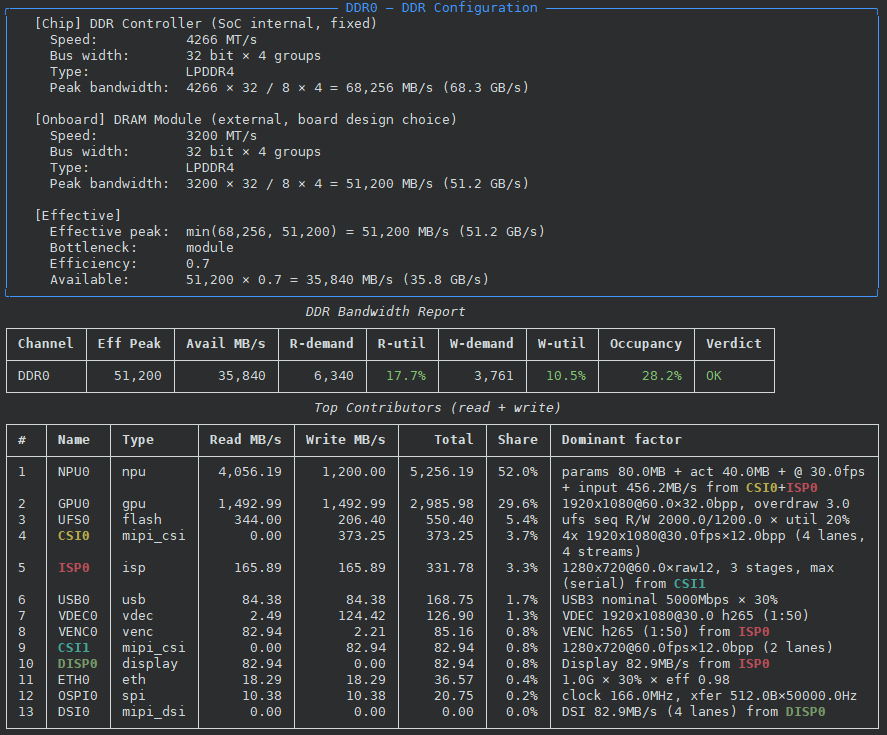
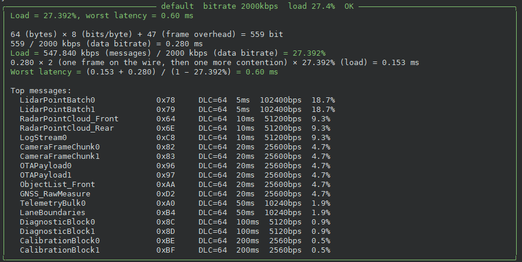
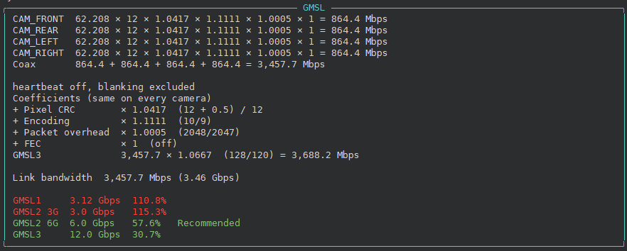
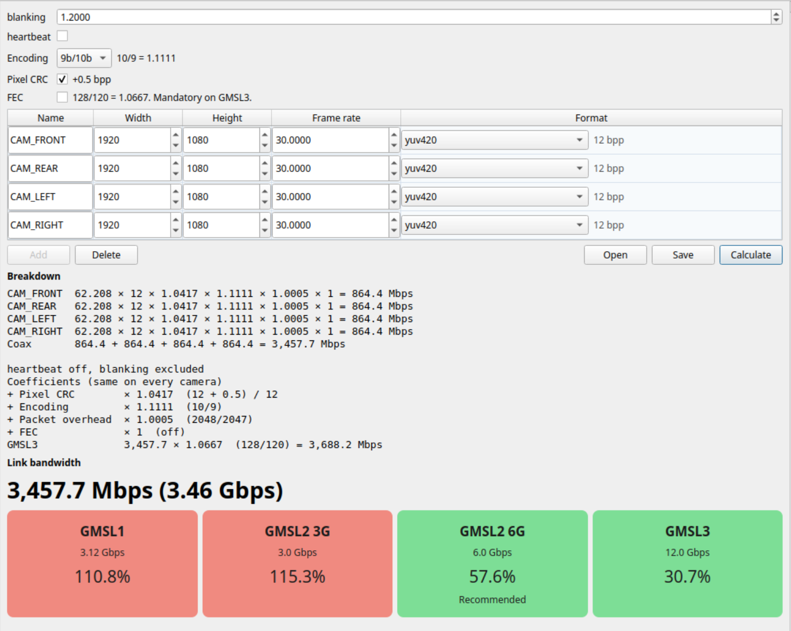

[English](README.md) | [中文](README_zh.md)

# buseval — SoC Bandwidth Evaluation Tool

Settle the DDR choice while the board can still change. When silicon measurements come back, check the estimate against them.

## Why

Bus width, DRAM speed, and how many devices sit on the board are locked in at layout. Too little bandwidth shows up as dropped frames and another spin of the board. Too much is paid for on every unit that ships. buseval is where that choice is made while the design is still open, and where it is checked again once the chip can be measured.

## Overall Goal

1. **Before layout** — Describe the scene: cameras, DBC, bitrates, TOPS. The engine adds up read and write demand, sets it against the DDR this board can deliver, and shows which blocks consume it.
2. **On the bench** — Read the same bandwidth back from the chip.
3. **After measurement** — Put the two figures side by side, see where the model drifted, and keep the memory parts on the configuration that is actually enough.

## Phase 1 (frozen)

Early prediction, from the command line and the canvas. Collection and comparison stay on the roadmap.

- 14 built-in estimators
- Entries: SoC DDR topology (empty canvas, a common SoC, or a private SoC), CAN health, GMSL link
- 7 common SoCs, a sample DBC, and a full-menu YAML template
- Report: top contributors, read and write demand, R-util / W-util / occupancy on one green-yellow-red scale. The verdict follows occupancy. Assumptions appear only when something is flagged
- Canvas: drag modules, connect `source`, evaluate in-process. The DDR card shows the occupancy percent in green, yellow, or red
- `lint` for missing items and contradictions

## Quick Start

```bash
pip install -e .

# 1. Try a sample (zero config)
buseval predict --soc tda4vh
```



```bash
# 2. CAN-FD health report (2 Mbps)
buseval predict --dbc examples/sample.dbc --can-bitrate 2000
# 2b. Multi-CAN: route different DBCs to specific CAN controllers
buseval predict --soc tda4vh \
    --can-dbc CAN0=examples/sample.dbc \
    --can-dbc CAN2=examples/sample_heavy.dbc
```



```bash
# 3. GMSL link bandwidth (independent tool, single link)
buseval predict --GMSL width=1920 height=1080 fps=30 bpp=12
# 3b. GMSL multi-link (YAML)
buseval predict --GMSL examples/gmsl_links.yaml
```



```bash
# 4. Configure your own YAML
cp examples/full_menu.yaml my.yaml
buseval lint my.yaml
buseval predict -t my.yaml
```

## GUI

The CLI and the GUI do not call each other. They share topology YAML. `buseval predict -t` is the Phase 1 command.

```bash
pip install -e '.[gui]'
buseval gui
```

Startup asks what to evaluate.

- **SoC DDR topology** — an empty canvas, a common SoC, or a private SoC file. The canvas has a module palette. Drag modules, draw `source` edges, double-click a node to edit parameters, double-click the DDR card to edit the channel. The DDR strip only shows status. Evaluate runs in the GUI process. A module's color deepens with its share of read+write bandwidth, and the DDR card shows occupancy in green, yellow, or red. The saved YAML still works with `buseval predict -t`.
- **CAN health** and **GMSL link** open their own pages from that dialog and from the File menu. They are not nodes on the topology canvas.

GMSL is one page: up to four cameras on one coax, the link formula, and a tier. The CLI panel above is the same calculation.



## Measurement

On a PC, `buseval collect` prints DDR read and write rates. `-o` also writes `meas.json`. There is no platform flag. The counters come from a scan of `perf list` and `/sys/bus/event_source/devices`, keeping a PMU that has both a read burst and a write burst. An aggregate pair is used alone; per-channel beats are summed only when no aggregate exists. CPU cache misses are not used. The total includes DMA and is not split per camera or NIC. Loading `amd_uncore` asks first; counting is system-wide and asks for an administrator password. A missing counter exits instead of inventing a number.

`src/buseval/embedded/` is what you copy onto a board. `pc_pmu.sh` prints the same count window, DDR read, and DDR write lines, keeping perf's full elapsed time. `-o` saves that text without color. It does not call buseval. `buseval collect --from` reads that text. CAN and GMSL are not part of this command. SoC DDR (TDA4VH first) uses that chip's DDR counter when it is already a `perf` event or a sysfs file. C is only for a counter that is neither.

```bash
buseval collect
buseval collect -o meas.json
buseval compare -t my.yaml -m meas.json
```

The GUI imports that same file from Measure → Import. Each front end compares on its own.

## Roadmap

- **Phase 1, frozen** — CLI and GUI for SoC DDR, CAN health, and GMSL. DDR occupancy is green, yellow, or red
- **Stage A** — `buseval collect` on the PC, using `perf`. CAN and GMSL are not in this command
- **Stage B** — SoC DDR counters (TDA4VH first), via `perf` or sysfs. C only when the counter is neither
- **Stage C** — On-board CAN / GMSL, which need that hardware, still `meas.json`
- Coefficient self-calibration stays later

## Supported Estimators

CAN (DBC) / CAN (load) / SPI / MIPI CSI / MIPI DSI / USB / ETH / FLASH (NAND / eMMC / UFS) / ISP / NPU / GPU / Display / VENC (H.264/H.265/AV1) / VDEC

MIPI CSI / DSI support a `count` parameter for multi-stream multiplexing on one port
(MIPI virtual channels VC0-3, or deserializer aggregation). `count: 4` models 4 cameras
on one CSI port for worst-case bandwidth evaluation; lane capacity is checked against
the aggregate. Defaults to 1 (backward compatible).

## Pipeline Wiring (`source`) & ISP Stages

Pipelines (ISP / NPU / VENC / VDEC / Display) can declare an optional `source`
field naming a master (e.g. `CSI1`) **or another pipeline** (e.g. `ISP0`) whose
output they consume. This wires the data flow explicitly (pipeline-to-pipeline
chaining supported via topological sort; cycles are rejected).

- **master source** (e.g. `CSI0`): the pipeline inherits the master's image
  dimensions (width/height/fps/bpp/count) and computes its own frame stream.
- **pipeline source** (e.g. `ISP0`): the pipeline receives the upstream
  pipeline's **output bandwidth** (write_bw) as its input — useful for
  `ISP0→NPU0` (NPU reads ISP's YUV output), `ISP0→VENC0` (encode ISP output),
  `ISP0→DISP0` (low-latency viewfinder path).
- IPs that read directly from DDR (no source) leave `source: null` and put
  width/height/fps/bpp directly in `params`.

```yaml
pipelines:
  - name: ISP0
    type: isp
    source: CSI1              # master → pipeline (inherit CSI1's dimensions)
    mode: serial              # serial = max of stages; parallel = sum
    stages:                   # fully customisable — name & factors are arbitrary
      - {name: bayer,     read_factor: 1.0, write_factor: 1.0}
      - {name: demosaic,  read_factor: 1.5, write_factor: 2.0}
      - {name: yuv_scale, read_factor: 2.0, write_factor: 1.0}
      # vendor-specific stages — any name, any factor:
      - {name: custom_NR,  read_factor: 1.8, write_factor: 1.2}
      - {name: WDR,        read_factor: 2.5, write_factor: 1.5}
    # each stage's DDR traffic = frame_stream × factor
  - name: VENC0
    type: venc                # encode ISP output for recording; codec = h264|h265|av1
    source: ISP0              # p2p: VENC reads ISP0's YUV output
    params: {width: 1280, height: 720, fps: 60, bpp: 16, codec: h265}
  - name: VDEC0
    type: vdec                # playback decoder (independent; no source)
    params: {width: 1920, height: 1080, fps: 30, bpp: 16, codec: h265}
  - name: NPU0
    type: npu
    source: [CSI0, ISP0]      # multi-source: CSI0 raw-domain (4-cam) + ISP0 YUV output (p2p)
                              #   each source uses its NATIVE fps (no sync/cap),
                              #   input is the SUM of per-source MB/s (not fps),
                              #   weight + activation are computed once (shared model)
    params: {params_mbytes: 80, activation_mbytes: 40, inference_fps: 30, tops_peak: 8}
  - name: DISP0
    type: display
    source: ISP0              # p2p: Display reads ISP0's YUV (low-latency path)
```

All SoC presets ship with a default wiring (CSI1→ISP0→{NPU0, VENC0, DISP0}; NPU0
also sources CSI0) as a starting point; edit the YAML to match your board.

### Codec compression ratios (VENC / VDEC)

`codec` selects a default compression ratio (configurable in
`_coefficients.yaml`): h264=30, h265=50, av1=70. Override per instance with
`params.compression_ratio: 40`.

## Common SoCs

TI TDA4VH / NVIDIA Orin NX / Horizon J5 / Qualcomm SA8155 / Rockchip RK3588 / Allwinner T527 / NXP S32G

## Documentation

- Design doc: [design.md](design.md)
- Estimation coefficients: `src/buseval/estimators/_coefficients.yaml`

## License

See [LICENSE](LICENSE).
