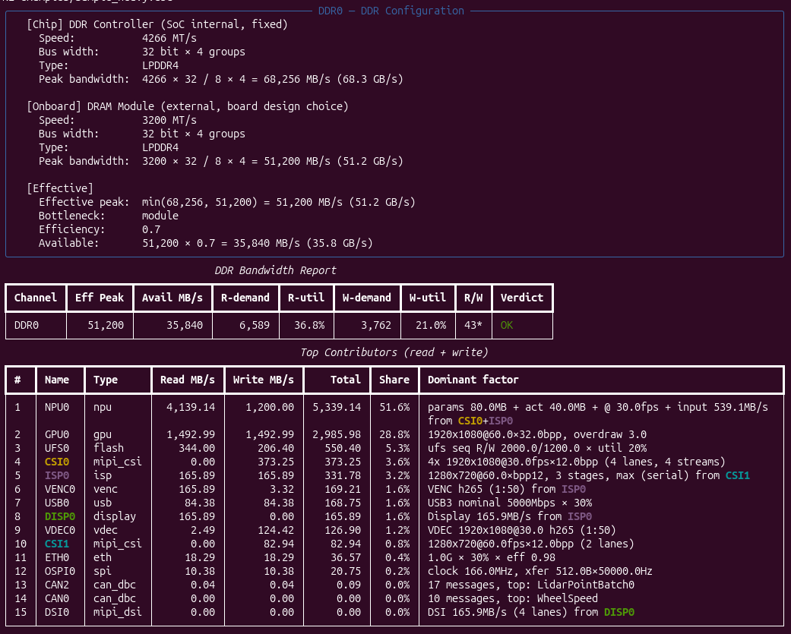
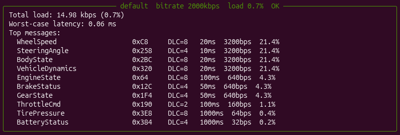
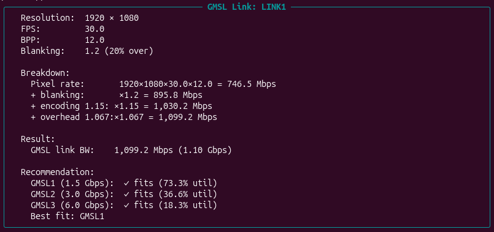

[English](README.md) | [中文](README_zh.md)

# buseval — SoC 带宽评估工具

预测和测量多核异构 SoC 的 DDR 带宽是否足够，覆盖外设（CAN/SPI/MIPI/USB/ETH/FLASH）与内部 pipeline（ISP/NPU/GPU/Display），并比对预测值与实测值。

## 为什么需要

现代 SoC 是多核异构系统，外设和加速器众多。项目前期往往靠经验估带宽，实测阶段才发现 DDR 不够，返工代价大。buseval 把"前期预测"和"实测对比"做成可重复、可审计的工程化流程。

## 总目标

1. **前期预测**：输入使用场景参数（DBC、分辨率/fps、bitrate/load、TOPS…），引擎估算各 master/pipeline 的读写带宽，汇总对比 DDR 可用带宽，给出余量和告警。
2. **实测采集**：通过 `perf` / `ddr-perf` 读取芯片实测带宽。
3. **预测 vs 实测对比**：量化偏差，归因到参数或公式，迭代校准。

## 现有目标（Phase 1）

仅做**前期预测**闭环，不做采集与对比。具体：

- 可插拔 estimator 引擎，内置 11 类外设/pipeline 估算器
- 三种入口：DBC 直读（CAN 健康报告）、SoC 预设、YAML 菜单
- 7 款主流芯片预设
- 假样例 DBC + 完整菜单模板
- 报告：Top-N 贡献、读写分离、assumptions 审计、breakdown 一句话注解
- CAN 健康报告（负载率/Top 报文/最坏帧延迟/过载建议）
- `lint` 漏项检查

## 快速开始

```bash
pip install -e .

# 1. 看样例（零配置）
buseval predict --soc tda4vh
```



```bash
# 2. CAN-FD 健康报告（2 Mbps）
buseval predict --dbc examples/sample.dbc --can-bitrate 2000
# 2b. 多 CAN 通路：把不同 DBC 挂到指定 CAN 控制器
buseval predict --soc tda4vh \
    --can-dbc CAN0=examples/sample.dbc \
    --can-dbc CAN2=examples/sample_heavy.dbc
```



```bash
# 3. GMSL 链路带宽（独立工具，单路）
buseval predict --GMSL width=1920 height=1080 fps=30 bpp=12
# 3b. GMSL 多路（YAML）
buseval predict --GMSL examples/gmsl_links.yaml
```



```bash
# 4. 自配 YAML
cp examples/full_menu.yaml my.yaml
buseval lint my.yaml
buseval predict -t my.yaml
```

## 路线图

- **Phase 1**：前期预测闭环（当前）
- **Phase 2**：实测采集（`perf` / `ddr-perf`）
- **Phase 3**：预测 vs 实测对比 + 归因链 + `scenario diff`
- **Phase 4**：系数自校准 + Web UI

## GMSL 链路带宽

独立工具（不属于 SoC topology）。计算给定摄像头分辨率下 GMSL 串行链路所需带宽：

```
link_bw = width × height × fps × bpp × blanking × encoding_factor × overhead_factor
```

系数（blanking=1.2, encoding=1.15, overhead=1.067）在 `_coefficients.yaml` 中，
可按调用覆盖。输出含 GMSL1/2/3 推荐表（1.5 / 3 / 6 Gbps），标注每路利用率和最佳匹配等级。

```bash
# 单路
buseval predict --GMSL width=1920 height=1080 fps=30 bpp=12
buseval predict --GMSL width=1920 height=1080 fps=30 bpp=12 blanking=1.25

# 多路 YAML（blanking 可在文件顶部全局设置）
buseval predict --GMSL examples/gmsl_links.yaml
```

## 支持的估算器

CAN(DBC) / CAN(load) / SPI / MIPI CSI / MIPI DSI / USB / ETH / FLASH(NAND/eMMC/UFS) / ISP / NPU / GPU / Display / VENC(H.264/H.265/AV1) / VDEC

MIPI CSI / DSI 支持 `count` 参数，建模单端口多路复用（MIPI 虚拟通道 VC0-3，或解串器汇聚）。
`count: 4` 表示一个 CSI 口接 4 路摄像头，做最坏情况带宽评估；lane 容量按聚合带宽检查。
默认 1（向后兼容）。

## Pipeline 连线（`source`）与 ISP stages

pipeline（ISP / NPU / VENC / VDEC / Display）可声明可选的 `source` 字段，指向某个
master（如 `CSI1`）**或另一个 pipeline**（如 `ISP0`）的输出。这样数据流显式可见
（pipeline→pipeline 链式支持，按拓扑排序计算；环依赖会报错）。

- **master 源**（如 `CSI0`）：pipeline 继承 master 的图像尺寸（width/height/fps/bpp/count），
  自己算帧流。
- **pipeline 源**（如 `ISP0`）：pipeline 拿到上游 pipeline 的**输出带宽**（write_bw）
  作输入——用于 `ISP0→NPU0`（NPU 读 ISP 的 YUV 输出）、`ISP0→VENC0`（编码 ISP 输出）、
  `ISP0→DISP0`（低延迟取景器通路）。
- 直接从 DDR 读的 IP（无源）保持 `source: null`，把 width/height/fps/bpp 直接写在
  `params` 里。

```yaml
pipelines:
  - name: ISP0
    type: isp
    source: CSI1              # master → pipeline（继承 CSI1 的尺寸）
    mode: serial              # serial = 各级取 max；parallel = 各级求和
    stages:                   # 完全可自定义 — 名称和系数任意
      - {name: bayer,     read_factor: 1.0, write_factor: 1.0}
      - {name: demosaic,  read_factor: 1.5, write_factor: 2.0}
      - {name: yuv_scale, read_factor: 2.0, write_factor: 1.0}
      # 厂商专有级 — 任意名称、任意系数：
      - {name: custom_NR,  read_factor: 1.8, write_factor: 1.2}
      - {name: WDR,        read_factor: 2.5, write_factor: 1.5}
    # 每级 DDR 流量 = frame_stream × factor
  - name: VENC0
    type: venc                # 编码 ISP 输出录像；codec = h264|h265|av1
    source: ISP0              # p2p：VENC 读 ISP0 的 YUV 输出
    params: {width: 1280, height: 720, fps: 60, bpp: 16, codec: h265}
  - name: VDEC0
    type: vdec                # 回放解码器（独立，无 source）
    params: {width: 1920, height: 1080, fps: 30, bpp: 16, codec: h265}
  - name: NPU0
    type: npu
    source: [CSI0, ISP0]      # 多源：CSI0 raw 域（4 路）+ ISP0 YUV 输出（p2p）
                              #   各源用原生 fps（不同步、不 cap），
                              #   input 是各源 MB/s 之和（不是 fps 之和），
                              #   weight + activation 只算一次（模型共享）
    params: {params_mbytes: 80, activation_mbytes: 40, inference_fps: 30, tops_peak: 8}
  - name: DISP0
    type: display
    source: ISP0              # p2p：Display 读 ISP0 的 YUV（低延迟通路）
```

所有 SoC 预设默认带一条连线（CSI1→ISP0→{NPU0, VENC0, DISP0}；NPU0 同时也 source CSI0）
作为起点，按你的板子在 YAML 里改即可。

### 编码器压缩比（VENC / VDEC）

`codec` 选默认压缩比（可在 `_coefficients.yaml` 配置）：h264=30、h265=50、av1=70。
单条覆盖用 `params.compression_ratio: 40`。

## 支持的 SoC 预设

TI TDA4VH / NVIDIA Orin NX / 地平线 J5 / 高通 SA8155 / 瑞芯微 RK3588 / 全志 T527 / NXP S32G

## 文档

- 设计文档：[design.md](design.md)
- 估算系数：`src/buseval/estimators/_coefficients.yaml`

## License

见 [LICENSE](LICENSE)。
