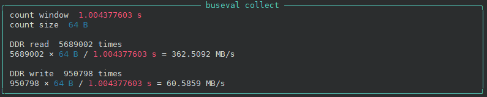

[English](README.md) | [中文](README_zh.md)

# buseval — SoC 带宽评估工具

立项按功能选定 SoC 与 DDR。工程样回板后，用整机读写核对加总预估与实测的偏差。

## 为什么需要

立项要先把功能确定下来。功能定了，才有依据选择 SoC，以及这块板要配的 DDR 容量。这一步是初步选型。

初步选型之后，同一套功能反复放进工具里做模拟预测。换 SoC 小型号，换 DDR 供应商，比较每一组的性能和价格，把料收到性价比最好的那一档。

采购按选定的小型号和供应商下料号，写入 BOM。财务按 SoC 和 DDR 两项计入单台成本。小型号不同，芯片成本不同；供应商不同，同容量的单价不同。模拟就是在这些组合里取性价比。

工程样回板核对的是整机总量。总量相近，仍可能是一个模块估高、另一个估低。CAN 负载和 GMSL 链路是立项后的器件选型，不参与这次 SoC 与 DDR 的选择，可用硬件采集验证。

## 快速开始

第一步是立项：按功能选 SoC 和 DDR 容量，再反复模拟小型号和供应商。CAN 和 GMSL 是立项后的选型。

```bash
pip install -e .

# 1. 看样例（零配置）
buseval predict --soc tda4vh
```


```bash
# 2. CAN-FD 健康报告（2 Mbps）
buseval predict --dbc examples/sample.dbc --can-bitrate 2000
# 多路：把不同 DBC 挂到指定 CAN 控制器
buseval predict --soc tda4vh --can-dbc CAN0=examples/sample.dbc --can-dbc CAN2=examples/sample_heavy.dbc
```


```bash
# 3. GMSL 链路带宽
buseval predict --GMSL width=1920 height=1080 fps=30 bpp=12
buseval predict --GMSL examples/gmsl_links.yaml
```


```bash
# 4. 自配 YAML
cp examples/full_menu.yaml my.yaml
buseval predict -t my.yaml
```

## 图形界面

```bash
pip install -e '.[gui]'
buseval gui
```

启动时先选类型。SoC DDR 是画布：拖入模块，连线，双击改参数，评估后 DDR 按占用率显示绿、黄、红。CAN 和 GMSL 是另外的页面。

GMSL 是一页：一根同轴上最多四路摄像头、链路公式，以及等级。上面的命令行面板是同一套计算。


## 实测

`buseval collect` 读本机内存控制器的读写次数，打出整机 DDR 带宽。`-o` 另写 `meas.json`。没有平台参数。计数器来自 `perf list` 和 `/sys/bus/event_source/devices`：同时有读突发和写突发的 PMU 才留下。已有合计计数时只用那一对；没有合计时才把通道相加。不用 CPU cache miss。总数包含 DMA，拆不开某一路摄像头或网卡。

一次计数代表多少字节，取自这块机器：事件的 scale、perf 指标表达式，或这次 `perf stat` 已经打出的 MB/s。取不到就不写 `count size`，也不编一个 MB/s。这次命令要输入管理员密码时，先给出风险说明；sudo 票据还在、不会问密码时，说明和密码都不出现。AMD 上若计数器还没注册，加载 `amd_uncore` 前同样先说明。计数器不存在就退出。

`src/buseval/embedded/ddr_pmu.sh` 拷到板子上跑，不调用 buseval。它打出同一套 count window、count size、DDR read、DDR write，时间保持 perf 的全部小数。`-o` 保存不带颜色的这段文字。`buseval collect --from` 读这段文字，字节数用其中的 count size。

```bash
buseval collect
buseval collect -o meas.json
buseval compare -t my.yaml -m meas.json
```



对比把实测的整机读写对着预测加总。GUI 用「实测 → 导入实测」读同一份 `meas.json`。

## 路线图

- **阶段 A（已有）**：本机 `buseval collect` 读整机 DDR。
- **阶段 B**：把 `ddr_pmu.sh` 拷到 SoC，仍是整机总量。还没有在板上跑过。内核没有这组计数时才考虑写 C。

## 支持的估算器

CAN / SPI / MIPI CSI / MIPI DSI / USB / ETH / FLASH / ISP / NPU / GPU / Display / VENC / VDEC

一个 CSI 或 DSI 口上的多路摄像头用 `count` 按路数相加。连线、ISP 级数和压缩比见 [design.md](design.md)。

## 常用芯片

TI TDA4VH / NVIDIA Orin NX / 地平线 J5 / 高通 SA8155 / 瑞芯微 RK3588 / 全志 T527 / NXP S32G

预设里的 DDR 速率和位宽按公开规格填写。

## 文档

- 设计文档：[design.md](design.md)
- 估算系数：`src/buseval/estimators/_coefficients.yaml`

## License

见 [LICENSE](LICENSE)。
